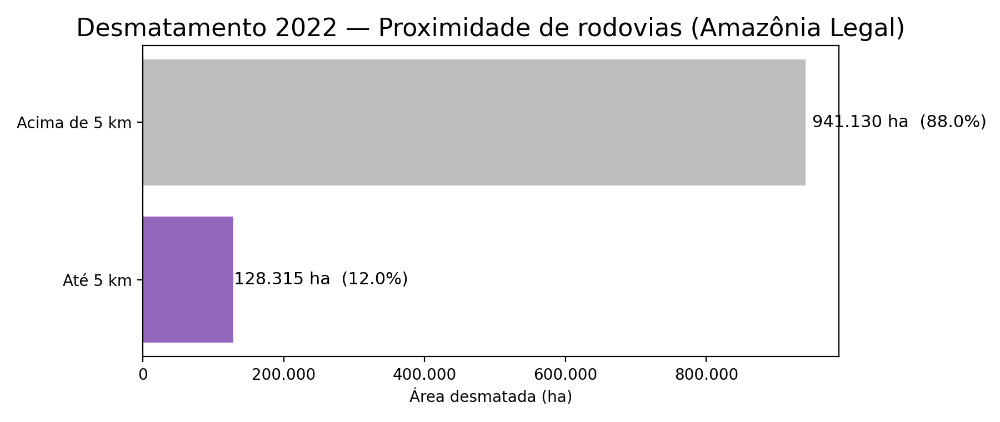

# Relatório prévio — Desmatamento PRODES 2022 (Amazônia Legal)

## Objetivo
Gerar uma visão inicial do desmatamento em 2022 na Amazônia Legal, relacionando:
- Unidades de Conservação (CNUC)
- Proximidade de rodovias (buffer 5 km)

## Dados e camadas
- PRODES 2022 (polígonos de desmatamento)
- CNUC (Unidades de Conservação)
- Rodovias
- Amazônia Legal (recorte por união de geometrias)

Todas as camadas foram padronizadas no **EPSG:5880**.

## Metodologia (resumo)
1. Recorte das camadas para a Amazônia Legal.
2. Cálculo do desmatamento **dentro vs fora** de UCs via interseção espacial.
3. Cálculo de desmatamento **até 5 km** de rodovias:
   - união das rodovias em uma geometria
   - buffer de 5.000 m
   - interseção com os polígonos PRODES

## Resultados principais (KPIs)
- **Total desmatado (2022):** 1.069.445 ha
- **Dentro de UC:** 147.563 ha (13,8%)
- **Fora de UC:** 921.882 ha (86,2%)
- **Até 5 km de rodovias:** 128.315 ha (12,0%)
- **Acima de 5 km:** 941.130 ha (88,0%)

## Visualizações
### Mapa
- `outputs/outputs/mapa_previo_2022.pdf`

### Gráficos
- Dentro vs Fora de UC: `outputs/grafico_dentro_fora_uc_2022.png`
- Proximidade de rodovias (5 km): `outputs/grafico_rodovias_5km_2022.png`
- Top 10 UCs por desmatamento: `outputs/grafico_top10_uc_2022.png`

## Top 10 UCs com maior desmatamento (ha)
1. ÁREA DE PROTEÇÃO AMBIENTAL TRIUNFO DO XINGU — 51.653 ha  
2. ESTAÇÃO ECOLÓGICA SOLDADO DA BORRACHA — 22.158 ha  
3. FLORESTA NACIONAL DO JAMANXIM — 10.689 ha  
4. ÁREA DE PROTEÇÃO AMBIENTAL DO TAPAJÓS — 10.011 ha  
5. PARQUE ESTADUAL DE GUAJARÁ-MIRIM — 7.459 ha  
6. RESERVA EXTRATIVISTA JACI-PARANÁ — 7.091 ha  
7. ESTAÇÃO ECOLÓGICA DA TERRA DO MEIO — 4.520 ha  
8. RESERVA EXTRATIVISTA CHICO MENDES — 3.919 ha  
9. FLORESTA NACIONAL DE ALTAMIRA — 2.808 ha  
10. RESERVA EXTRATIVISTA GUARIBA-ROOSEVELT — 2.796 ha  

## Insights rápidos
- O desmatamento em 2022 foi majoritariamente **fora de UCs** (86,2%), mas **13,8% dentro de UCs** é um valor relevante e merece investigação por categoria/tipo de UC.
- Há forte concentração em poucas UCs: a APA Triunfo do Xingu lidera com ampla diferença.
- A métrica “até 5 km de rodovias” indica associação com acessibilidade, mas é um corte binário; análises por múltiplas distâncias podem melhorar a leitura.

## Próximos passos sugeridos
- Repetir a análise para mais anos (série temporal).
- Testar buffers 1 km, 2 km, 10 km e comparar curvas.
- Agrupar UCs por categoria (APA, FLONA, ESEC, RESEX) e comparar.
- Criar uma tabela/visão por município ou estado (agregação administrativa).

## Visualizações

### Mapa
[Mapa (PDF)](mapa_previo_2022.pdf)

### Dentro vs Fora de UC

### Proximidade de rodovias (5 km)

### Top 10 UCs por desmatamento

